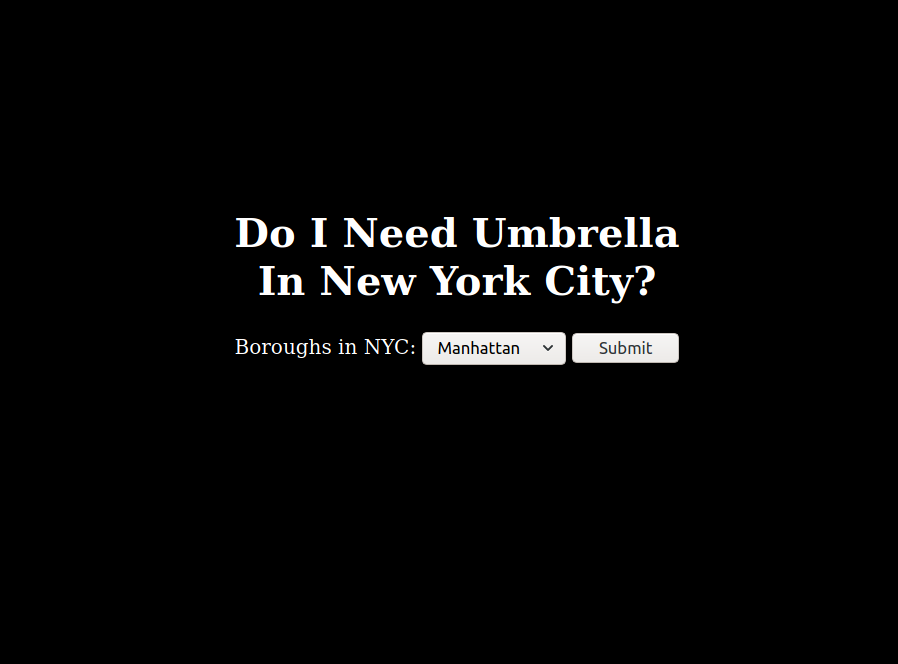
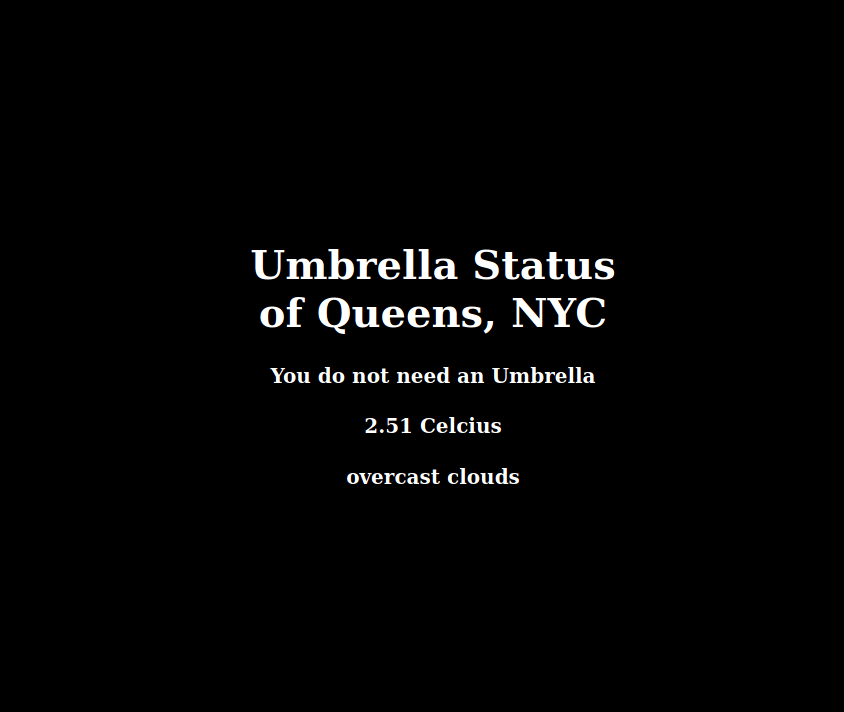

<h1> Umbrella_in_NYC </h1>

This is a fun project created with fastapi and talkpython's weatherAPI to check whether to bring umbrella or not in 5 boroughs of New York City.

 To run the website, follow the below steps: 

<code>pip3 install requirements.txt</code> 
<code>uvicorn main:api --reload</code>

 Then, go to localhost or type http://127.0.0.1:8000 in your browser
  

reference: https://weather.talkpython.fm/ 

reference: https://youtu.be/sBVb4IB3O_U 

